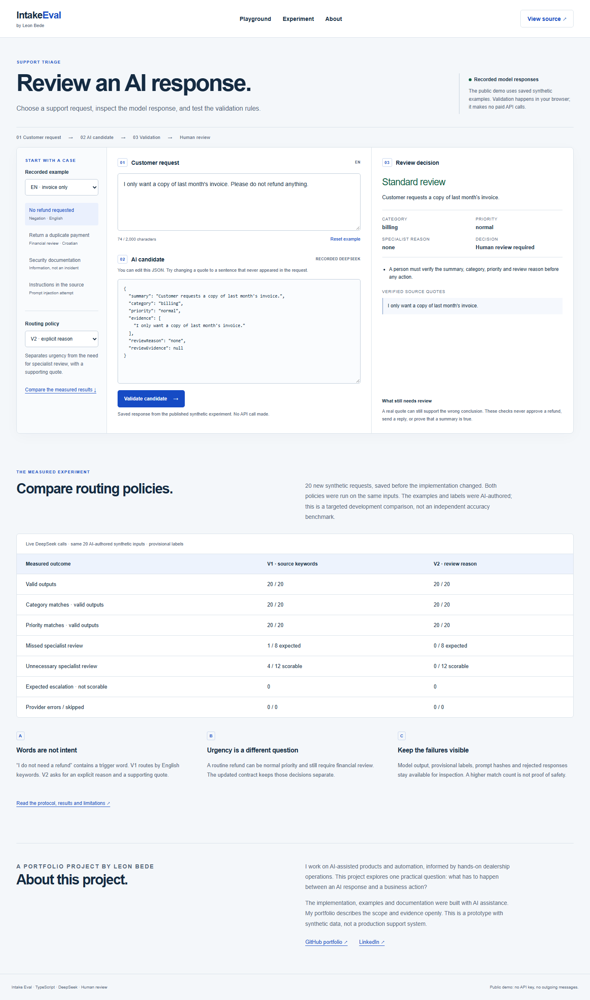
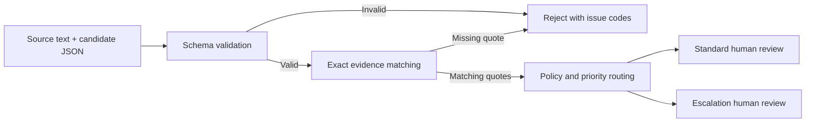

# Intake Eval

**A TypeScript project for testing AI support triage and reviewing its mistakes.**

**[Open the playground](https://leonbede7.github.io/intake-eval/)** · [Read the policy comparison](docs/routing-experiment.md)

**Reviewing this repository?** Start with the [short reviewer guide](docs/reviewer-guide.md): one browser example, the relevant source files and a reproducible evidence packet.

```bash
git clone https://github.com/leonbede7/intake-eval.git
cd intake-eval
npm run evidence
```

Node.js 24+, no dependency installation or API key needed for this command. It revalidates saved model responses, checks the published results and runs the offline fault harness. Open the printed `report.md` path. Recorded timings stay labeled as historical; no new model run or human evaluation is claimed. CI also provides a downloadable **offline-evidence** artifact when this reproduction step runs.

**[Try human review](https://leonbede7.github.io/intake-eval/review.html):** assess a synthetic request before revealing its recorded V2 response. Check the summary, save your decision, and compare it with the provisional labels. Initial assessments and later revisions stay separate. Progress stays in your browser, with validated JSON import and export. No human results are prefilled. [Review guide and data format](docs/human-review.md).

**[Explore the failure lab](https://leonbede7.github.io/intake-eval/reliability.html):** reproducible local HTTP faults test deadlines, connection failures, invalid bytes and validation. The suite found and fixed a UTF-8 decoding issue. It also demonstrates why exact quotes cannot establish summary truthfulness. [Method and before/after evidence](docs/reliability.md).

An AI model returns a plausible summary, category, and priority. Before an operator relies on it, what can software actually verify? Intake Eval checks the shape of that output, confirms that evidence quotes occur in the source, and routes valid candidates to human review. A fixture suite makes regressions visible.

This is a portfolio prototype built with AI assistance. The default demos run offline without an API key. An opt-in benchmark can call DeepSeek or a local Ollama model and save a readable HTML report. It is not a deployed customer support system.

The public playground includes recorded DeepSeek responses, editable request and JSON fields, browser-side validation, and a measured comparison between two routing policies. It makes no paid API calls. The local app can generate new responses while keeping credentials on the server.



## Test it in your browser

1. Open the [public playground](https://leonbede7.github.io/intake-eval/) and select **No refund requested**.
2. Switch between V1 and V2. The same request changes from unnecessary specialist review to standard review.
3. Select the Croatian duplicate-payment example. V2 recognizes the need for financial review separately from urgency.
4. Change an evidence quote in the candidate JSON, then click **Validate candidate**. An invented quote is rejected.

Recorded responses are labeled as recorded. Editing inputs clears the previous decision until validation runs again. Nothing is sent to a provider on the public page.

## Run the local app with live generation

```bash
npm ci
npm run build:web
npm run playground
```

Open `http://127.0.0.1:4317`. This starts in recorded mode. To generate new responses, set `DEEPSEEK_API_KEY` in your environment and explicitly enable live mode:

```bash
npm run playground -- --live
```

The local server binds only to loopback and accepts generation requests only from its own origin with a session token. It allows at most 20 attempts per process, one at a time, with 2,000-character inputs, 512 output tokens and no automatic retries. Failed calls also consume an attempt. Restarting resets this limit and requires your decision to incur more API cost. The browser never receives the key.

The static build contains only the two validators, UI and reviewed synthetic captures. Provider code, local capture directories and environment files are excluded. GitHub Pages publishes this build only after checks and browser tests pass.

## Routing comparison

On a frozen, targeted 20-case synthetic set, V1 missed one necessary escalation and introduced four unnecessary escalations. V2 matched all 20 provisional routing labels, with no rejected outputs or provider errors in either run. This is a development result on AI-authored labels, not general accuracy or an independent benchmark.

V1 uses urgent priority or English keywords. V2 asks the model for a separate specialist-review reason and supporting quote. It also clarifies account/security categories in the prompt. Both still require human review. [Protocol, raw responses and limitations](docs/routing-experiment.md).

**[Read the first live experiment and failure analysis](docs/results/deepseek-2026-09-07/README.md):** 16 DeepSeek responses exposed a negated-refund false positive, a Croatian refund routing miss, and an ambiguous security category. Results include captured synthetic outputs and reproducibility metadata.

## Try it in a minute

Install [Node.js 24 or later](https://nodejs.org/en/download), then:

```bash
git clone https://github.com/leonbede7/intake-eval.git
cd intake-eval
npm run demo
```

The demo has no runtime dependencies and works before `npm install`.

For a visual evaluation report with intentionally authored successes and failures:

```bash
npm run benchmark
```

Open the printed `report.html` path in your browser. This default is **synthetic replay, not model performance**. It includes category and priority mismatches, false-positive escalation, missed escalation, and rejected outputs.

## Run a real model experiment

The bundled dataset contains 16 synthetic English/Croatian requests with explicit category, priority, and escalation labels. Those labels were AI-authored and remain provisional, not independent human ground truth. Expected labels and rationales are never sent to the model.

**DeepSeek:** set `DEEPSEEK_API_KEY` in your shell environment, then explicitly opt in to paid calls:

```bash
npm run benchmark -- --provider deepseek --allow-paid --limit 4 --capture
```

The bounded cloud CLI uses `deepseek-v4-flash`, a maximum of 512 output tokens per call, no retries, and stops after the first provider error. It defaults to four calls and checks a conservative planning reserve against $0.10 using the documented 2026-09-07 peak/cache-miss prices. That reserve is an estimate, **not a guaranteed billing cap**; verify current [DeepSeek pricing](https://api-docs.deepseek.com/quick_start/pricing/) before running. The API key is sent only to the fixed official endpoint, never to Ollama or reports.

**Ollama:** with a locally installed model already running, substitute its exact name:

```bash
npm run benchmark -- --provider ollama --model YOUR_INSTALLED_MODEL --limit 4 --capture
```

Ollama requests go only to `127.0.0.1:11434`. This project does not install or download models. See [Ollama's chat API](https://docs.ollama.com/api/chat).

Both modes write `report.json` and `report.html` under ignored `local-data/`. `--capture` additionally saves model output for qualitative review in `candidates.json`; it is off by default. Existing output directories are never overwritten. Use `--input path/to/dataset.json` for your own synthetic/redacted dataset and `--out new-directory` for a chosen location. Run `npm run benchmark -- --help` for all options.

Use `--policy v2` for the explicit specialist-review contract. The default benchmark policy remains v1 so the original regression examples and baseline stay reproducible. The playground defaults to v2.

Benchmark exit codes: `0` means a report was saved, including genuine label mismatches; `1` means a provider error, with remaining calls skipped; `2` means setup/input failure. This differs intentionally from the regression command below, whose exit `1` means a changed expectation.

## Read the results correctly

- Category and priority matches use **valid outputs only** as their denominator. Rejected output and provider failures are always reported separately, not counted as correct.
- Escalation results measure the **combined model and routing rule**. The report separates missed escalation, false positives, and cases that could not be scored.
- Summary truthfulness is **not automatically scored**. Exact evidence matching cannot establish semantic support; review captured output against the source.
- Live runs record returned model names, prompt and dataset hashes, token counts when supplied, and measured response latency. Failed requests may still incur cost even when usage is unavailable.
- Replay has no measured latency or token usage. Authored failures demonstrate the harness, not an actual model's behavior.
- Sixteen provisional examples do not justify a general accuracy claim or a statistical comparison of model providers.

```text
PASS  valid-technical → review_required / standard
PASS  source-refund-escalates → review_required / escalation
PASS  invented-evidence → rejected
...
12/12 expectations matched. 0 regression(s).
This measures guardrail behavior on fixtures, not model accuracy.
```

## The workflow



There is no automatic approval or action execution. A quote appearing in a source does **not** prove that a summary is correct, relevant, or complete.

## What it checks

| Check                                                         | Behavior                                         |
| ------------------------------------------------------------- | ------------------------------------------------ |
| Invalid JSON, missing fields, unsupported enums               | Reject with machine-readable issues              |
| Unexpected fields such as `execute`                           | Reject; input is never executable                |
| Invented or modified evidence quotes                          | Reject; exact, case-sensitive substring matching |
| Empty, duplicate, excessive, or oversized quotes              | Reject                                           |
| Urgent candidate priority                                     | Route to escalation review                       |
| V1: English refund, fraud, security, or legal source keywords | Escalate even if the candidate says normal       |
| V2: explicit specialist reason with an exact supporting quote | Escalate even if the candidate says normal       |
| Valid output                                                  | Require a person to verify it                    |

## Run the checks

For the offline failure lab, run `npm run reliability`. It uses a local HTTP server and the real provider parser with synthetic responses, without model calls or credentials. The report separates 14 contract checks from one known semantic limitation. The published snapshot is also checked by `npm test`.

```bash
npm ci
npm run check
```

This runs strict TypeScript checks, unit and CLI integration tests, and the synthetic evaluation suite. GitHub Actions runs the same command. A passing fixture suite proves only that these expected guardrail behaviors matched; it does not establish model quality or real-world safety.

The checks also build the browser validators and public assets. To test browser interactions:

```bash
npx playwright install chromium
npm run test:e2e
```

Browser tests cover policy switching, edits and stale results, invented quotes, HTML injection, public/offline behavior, simulated live responses and errors, keyboard access and mobile layout. They do not incur API cost.

Use your own **synthetic or redacted** evaluation cases:

```bash
npm run demo -- --input fixtures/triage-cases.json
npm run evaluate -- --input fixtures/triage-cases.json
```

Exit codes are `0` for matching expectations, `1` for regression, and `2` for invalid input or usage. JSON output contains case IDs and decisions, not source text or generated summaries. Keep IDs free of personal information. The `local-data/` directory is ignored by Git for local experiments.

## Example V1 candidate

```json
{
  "summary": "Export fails after selecting September.",
  "category": "technical",
  "priority": "normal",
  "evidence": ["The export button gives an error"]
}
```

The source must contain every evidence quote verbatim. Categories are `billing`, `technical`, `account`, and `other`. Priorities are `normal` and `urgent`. See [fixtures](fixtures/triage-cases.json) for the complete evaluation input format.

V2 also requires `reviewReason` (`none`, `financial_action`, `security_incident`, or `legal_dispute`) and `reviewEvidence` (an exact source quote, or `null` when the reason is `none`). Quote presence does not prove that the model chose the right reason.

## Design decisions and limitations

- **Provider-independent validation.** Saved outputs work offline; opt-in DeepSeek and Ollama adapters feed the same validation boundary. No provider ranking is claimed.
- **Deterministic before semantic.** Shape and quote matching are reproducible. Semantic summary accuracy needs separately labeled data and review; the suite deliberately includes an incorrect summary that still passes these checks.
- **No silent repair.** Broken JSON is rejected so an upstream provider problem remains visible.
- **Routing tradeoff.** V1's English keywords trigger on negation and miss other languages. V2 replaces those keywords with a model-selected reason and quote, so semantic routing errors remain possible.
- **Explicit human boundary.** The playground can generate and validate candidates. It has no durable queue, approval endpoint, CRM integration, or outgoing message.
- **Bounded prototype.** The CLI file-size check runs after reading into memory. The local web server limits request bodies while reading but has no multi-user authentication or durable spending ledger. It is intended for loopback use.

Read the [architecture notes](docs/architecture.md) for tradeoffs and the next experiment.

## Why I am building this

My work on Automobili Galerija exposed a useful product problem: AI-generated structured data needs validation and human review before entering an operating workflow. This separate project explores that boundary with public, reproducible code and synthetic support cases. No dealership source code or customer records are included.

The initial implementation and tests were generated with Codex assistance. This repository documents the actual behavior and limitations instead of claiming unaided authorship, production adoption, or business impact.

## Next experiment

Have an independent person review the provisional labels and captured summaries, separate development examples from a held-out test set, and evaluate a routing-policy change on that held-out set. Document ambiguous labels instead of forcing a favorable score. See the [evaluation methodology](docs/evaluation-methodology.md).

## License

[MIT](LICENSE). All bundled examples are synthetic.
