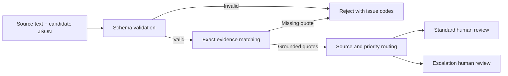

# Intake Eval

**A small TypeScript evaluation harness for human-reviewed AI support triage.**

An AI model returns a plausible summary, category, and priority. Before an operator relies on it, what can software actually verify? Intake Eval checks the shape of that output, confirms that evidence quotes occur in the source, and routes valid candidates to human review. A fixture suite makes regressions visible.

This is an early portfolio prototype built with AI assistance. It runs locally with synthetic data, makes no model calls, and requires no API key. It is not a deployed customer support system or a measured model benchmark.

## Try it in a minute

Install [Node.js 24 or later](https://nodejs.org/en/download), then:

```bash
git clone https://github.com/leonbede7/intake-eval.git
cd intake-eval
npm run demo
```

The demo has no runtime dependencies and works before `npm install`.

```text
PASS  valid-technical → review_required / standard
PASS  source-refund-escalates → review_required / escalation
PASS  invented-evidence → rejected
...
12/12 expectations matched. 0 regression(s).
This measures guardrail behavior on fixtures, not model accuracy.
```

## The workflow



There is no automatic approval or action execution. A quote appearing in a source does **not** prove that a summary is correct, relevant, or complete.

## What it checks

| Check | Behavior |
| --- | --- |
| Invalid JSON, missing fields, unsupported enums | Reject with machine-readable issues |
| Unexpected fields such as `execute` | Reject; input is never executable |
| Invented or modified evidence quotes | Reject; exact, case-sensitive substring matching |
| Empty, duplicate, excessive, or oversized quotes | Reject |
| Urgent candidate priority | Route to escalation review |
| English refund, fraud, security, or legal keywords in source | Escalate even if the candidate says normal |
| Valid output | Require a person to verify it |

## Run the checks

```bash
npm ci
npm run check
```

This runs strict TypeScript checks, unit and CLI integration tests, and the synthetic evaluation suite. GitHub Actions runs the same command. A passing fixture suite proves only that these expected guardrail behaviors matched; it does not establish model quality or real-world safety.

Use your own **synthetic or redacted** evaluation cases:

```bash
npm run demo -- --input fixtures/triage-cases.json
npm run evaluate -- --input fixtures/triage-cases.json
```

Exit codes are `0` for matching expectations, `1` for regression, and `2` for invalid input or usage. JSON output contains case IDs and decisions, not source text or generated summaries. Keep IDs free of personal information. The `local-data/` directory is ignored by Git for local experiments.

## Example candidate

```json
{
  "summary": "Export fails after selecting September.",
  "category": "technical",
  "priority": "normal",
  "evidence": ["The export button gives an error"]
}
```

The source must contain every evidence quote verbatim. Categories are `billing`, `technical`, `account`, and `other`. Priorities are `normal` and `urgent`. See [fixtures](fixtures/triage-cases.json) for the complete evaluation input format.

## Design decisions and limitations

- **Provider-independent boundary.** The harness accepts saved output from any model. A live adapter and provider comparison have not been implemented.
- **Deterministic before semantic.** Shape and quote matching are reproducible. Semantic summary accuracy needs separately labeled data and review; the suite deliberately includes an incorrect summary that still passes these checks.
- **No silent repair.** Broken JSON is rejected so an upstream provider problem remains visible.
- **Simple routing.** English keyword matching favors review, can trigger on negated statements, and misses synonyms and other languages. It is not a severity classifier.
- **Explicit human boundary.** Review queues are returned as data. There is no dashboard, durable queue, audit store, approval endpoint, CRM integration, or outgoing message.
- **Bounded prototype.** This is a local CLI, not a hardened public endpoint. The file-size check runs after reading the file into memory; do not expose it as an upload service without streaming limits and authentication.

Read the [architecture notes](docs/architecture.md) for tradeoffs and the next experiment.

## Why I am building this

My work on Automobili Galerija exposed a useful product problem: AI-generated structured data needs validation and human review before entering an operating workflow. This separate project explores that boundary with public, reproducible code and synthetic support cases. No dealership source code or customer records are included.

The initial implementation and tests were generated with Codex assistance. This repository documents the actual behavior and limitations instead of claiming unaided authorship, production adoption, or business impact.

## Next experiment

Collect a small, independently labeled synthetic set covering ambiguous requests, contradictory summaries, and multilingual escalation. Add a live provider adapter, freeze the inputs and model settings, and measure semantic errors separately from schema failures. Results will be published only after that experiment exists.

## License

[MIT](LICENSE). All bundled examples are synthetic.
