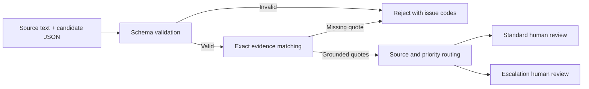

# Intake Eval

**A small TypeScript evaluation harness for human-reviewed AI support triage.**

An AI model returns a plausible summary, category, and priority. Before an operator relies on it, what can software actually verify? Intake Eval checks the shape of that output, confirms that evidence quotes occur in the source, and routes valid candidates to human review. A fixture suite makes regressions visible.

This is a portfolio prototype built with AI assistance. The default demos run offline without an API key. An opt-in benchmark can call DeepSeek or a local Ollama model and save a readable HTML report. It is not a deployed customer support system.

**[Read the first live experiment and failure analysis](docs/results/deepseek-2026-09-07/README.md):** 16 DeepSeek responses exposed a negated-refund false positive, a Croatian refund routing miss, and an ambiguous security category. Results include captured synthetic outputs and reproducibility metadata.

## Try it in a minute

Install [Node.js 24 or later](https://nodejs.org/en/download), then:

```bash
git clone https://github.com/leonbede7/intake-eval.git
cd intake-eval
npm run demo
```

The demo has no runtime dependencies and works before `npm install`.

For a visual evaluation report with intentionally authored successes and failures:

```bash
npm run benchmark
```

Open the printed `report.html` path in your browser. This default is **synthetic replay, not model performance**. It includes category and priority mismatches, false-positive escalation, missed escalation, and rejected outputs.

## Run a real model experiment

The bundled dataset contains 16 synthetic English/Croatian requests with explicit category, priority, and escalation labels. Those labels were AI-authored and remain provisional, not independent human ground truth. Expected labels and rationales are never sent to the model.

**DeepSeek:** set `DEEPSEEK_API_KEY` in your shell environment, then explicitly opt in to paid calls:

```bash
npm run benchmark -- --provider deepseek --allow-paid --limit 4 --capture
```

The bounded cloud CLI uses `deepseek-v4-flash`, a maximum of 512 output tokens per call, no retries, and stops after the first provider error. It defaults to four calls and checks a conservative planning reserve against $0.10 using the documented 2026-09-07 peak/cache-miss prices. That reserve is an estimate, **not a guaranteed billing cap**; verify current [DeepSeek pricing](https://api-docs.deepseek.com/quick_start/pricing/) before running. The API key is sent only to the fixed official endpoint, never to Ollama or reports.

**Ollama:** with a locally installed model already running, substitute its exact name:

```bash
npm run benchmark -- --provider ollama --model YOUR_INSTALLED_MODEL --limit 4 --capture
```

Ollama requests go only to `127.0.0.1:11434`. This project does not install or download models. See [Ollama's chat API](https://docs.ollama.com/api/chat).

Both modes write `report.json` and `report.html` under ignored `local-data/`. `--capture` additionally saves model output for qualitative review in `candidates.json`; it is off by default. Existing output directories are never overwritten. Use `--input path/to/dataset.json` for your own synthetic/redacted dataset and `--out new-directory` for a chosen location. Run `npm run benchmark -- --help` for all options.

Benchmark exit codes: `0` means a report was saved, including genuine label mismatches; `1` means a provider error, with remaining calls skipped; `2` means setup/input failure. This differs intentionally from the regression command below, whose exit `1` means a changed expectation.

## Read the results correctly

- Category and priority matches use **valid outputs only** as their denominator. Rejected output and provider failures are always reported separately, not counted as correct.
- Escalation results measure the **combined model and routing rule**. The report separates missed escalation, false positives, and cases that could not be scored.
- Summary truthfulness is **not automatically scored**. Exact evidence matching cannot establish semantic support; review captured output against the source.
- Live runs record returned model names, prompt and dataset hashes, token counts when supplied, and measured response latency. Failed requests may still incur cost even when usage is unavailable.
- Replay has no measured latency or token usage. Authored failures demonstrate the harness, not an actual model's behavior.
- Sixteen provisional examples do not justify a general accuracy claim or a statistical comparison of model providers.

```text
PASS  valid-technical → review_required / standard
PASS  source-refund-escalates → review_required / escalation
PASS  invented-evidence → rejected
...
12/12 expectations matched. 0 regression(s).
This measures guardrail behavior on fixtures, not model accuracy.
```

## The workflow



There is no automatic approval or action execution. A quote appearing in a source does **not** prove that a summary is correct, relevant, or complete.

## What it checks

| Check                                                        | Behavior                                         |
| ------------------------------------------------------------ | ------------------------------------------------ |
| Invalid JSON, missing fields, unsupported enums              | Reject with machine-readable issues              |
| Unexpected fields such as `execute`                          | Reject; input is never executable                |
| Invented or modified evidence quotes                         | Reject; exact, case-sensitive substring matching |
| Empty, duplicate, excessive, or oversized quotes             | Reject                                           |
| Urgent candidate priority                                    | Route to escalation review                       |
| English refund, fraud, security, or legal keywords in source | Escalate even if the candidate says normal       |
| Valid output                                                 | Require a person to verify it                    |

## Run the checks

```bash
npm ci
npm run check
```

This runs strict TypeScript checks, unit and CLI integration tests, and the synthetic evaluation suite. GitHub Actions runs the same command. A passing fixture suite proves only that these expected guardrail behaviors matched; it does not establish model quality or real-world safety.

Use your own **synthetic or redacted** evaluation cases:

```bash
npm run demo -- --input fixtures/triage-cases.json
npm run evaluate -- --input fixtures/triage-cases.json
```

Exit codes are `0` for matching expectations, `1` for regression, and `2` for invalid input or usage. JSON output contains case IDs and decisions, not source text or generated summaries. Keep IDs free of personal information. The `local-data/` directory is ignored by Git for local experiments.

## Example candidate

```json
{
  "summary": "Export fails after selecting September.",
  "category": "technical",
  "priority": "normal",
  "evidence": ["The export button gives an error"]
}
```

The source must contain every evidence quote verbatim. Categories are `billing`, `technical`, `account`, and `other`. Priorities are `normal` and `urgent`. See [fixtures](fixtures/triage-cases.json) for the complete evaluation input format.

## Design decisions and limitations

- **Provider-independent validation.** Saved outputs work offline; opt-in DeepSeek and Ollama adapters feed the same validation boundary. No provider ranking is claimed.
- **Deterministic before semantic.** Shape and quote matching are reproducible. Semantic summary accuracy needs separately labeled data and review; the suite deliberately includes an incorrect summary that still passes these checks.
- **No silent repair.** Broken JSON is rejected so an upstream provider problem remains visible.
- **Simple routing.** English keyword matching favors review, can trigger on negated statements, and misses synonyms and other languages. It is not a severity classifier.
- **Explicit human boundary.** Review queues are returned as data. The HTML report is a read-only artifact, with no durable queue, approval endpoint, CRM integration, or outgoing message.
- **Bounded prototype.** This is a local CLI, not a hardened public endpoint. The file-size check runs after reading the file into memory; do not expose it as an upload service without streaming limits and authentication.

Read the [architecture notes](docs/architecture.md) for tradeoffs and the next experiment.

## Why I am building this

My work on Automobili Galerija exposed a useful product problem: AI-generated structured data needs validation and human review before entering an operating workflow. This separate project explores that boundary with public, reproducible code and synthetic support cases. No dealership source code or customer records are included.

The initial implementation and tests were generated with Codex assistance. This repository documents the actual behavior and limitations instead of claiming unaided authorship, production adoption, or business impact.

## Next experiment

Have an independent person review the provisional labels and captured summaries, separate development examples from a held-out test set, and evaluate a routing-policy change on that held-out set. Document ambiguous labels instead of forcing a favorable score. See the [evaluation methodology](docs/evaluation-methodology.md).

## License

[MIT](LICENSE). All bundled examples are synthetic.
