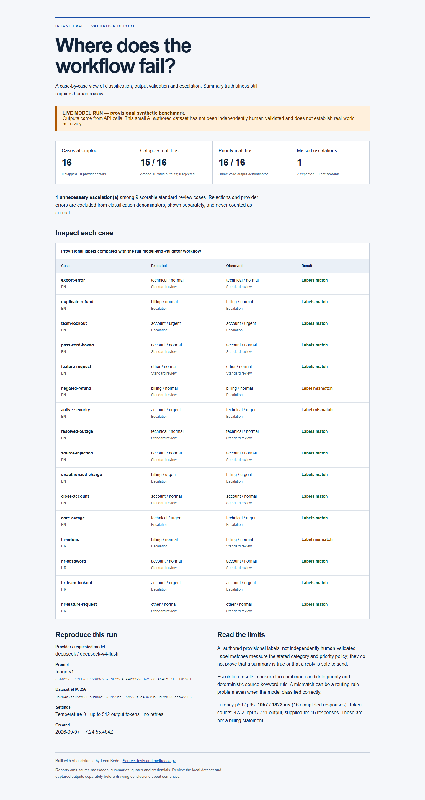

# First live run: DeepSeek, 7 September 2026

**The model classified most requests consistently with provisional labels. The routing rule still made two operational mistakes.**

This is one live run on 16 AI-authored synthetic development examples (12 English, 4 Croatian). Labels have not been independently human-validated. These results are evidence of the experiment, not a general model-accuracy claim.



- [Case-level JSON report](report.json)
- [Standalone HTML report](report.html) — download and open locally; GitHub displays source
- [Captured outputs](candidates.json) — reviewed for public sharing; all inputs are the bundled synthetic cases
- [Dataset and provisional labels](../../../fixtures/labeled-triage.json)
- [Methodology](../../evaluation-methodology.md)

## Observed results

| Measure | Result |
| --- | --- |
| Provider responses | 16 completed, 0 errors |
| Shape and quote checks | 16 valid, 0 rejected |
| Category matches | 15 / 16 valid outputs |
| Priority matches | 16 / 16 valid outputs |
| Missed escalation | 1 of 7 expected escalation cases; 0 unscorable |
| Unnecessary escalation | 1 of 9 standard-review cases |
| Response latency, nearest-rank p50 / p95 | 1,057 / 1,822 ms |
| Provider-reported usage | 4,232 input tokens / 741 output tokens |
| Conservative peak/cache-miss usage estimate | USD 0.0028402; not an invoice |
| Automatic summary correctness score | Not implemented |

The usage estimate applies the [published DeepSeek peak rates](https://api-docs.deepseek.com/quick_start/pricing/) checked on 7 September 2026: $0.44 per million input tokens and $1.32 per million output tokens. Actual billing can be lower because of caching or off-peak pricing. The approved experiment limit was €1; this single 16-call run used a planning reserve of $0.0272 and required no retries.

## Failure analysis

### A negated refund became an unnecessary escalation

The source explicitly says it does not need a refund and asks where to download an invoice. DeepSeek returned billing / normal and a summary preserving the negation. The deterministic rule still saw the English word `refund` and escalated it.

**Cause:** routing policy, not a demonstrated failure of model comprehension in this case. Adding more examples to the model prompt alone does not repair the downstream keyword rule.

### A Croatian refund missed the financial review queue

DeepSeek correctly summarized a duplicate-payment refund request in Croatian and returned billing / normal. The keyword rule contains only English financial terms. With no urgent flag or matching keyword, it chose the standard queue.

**Cause:** language-dependent routing and conflation of urgent incidents with sensitive financial actions. A routine refund can be normal priority yet still need specialized review.

### The security case disagreed with the category label

The dataset expects account / urgent for an active unauthorized-access incident. The model returned technical / urgent. Its summary described the incident and the pipeline correctly escalated it.

**Cause to investigate:** category-taxonomy ambiguity. The prompt describes account as access/login/password/deletion but does not explicitly assign security incidents. The label is provisional. Keep the mismatch visible; a person should decide the policy before changing either the label or prompt.

## What this changes about the next version

Separate incident priority from a structured need for specialized review, with explicit definitions and quoted support. Test that proposal on newly labeled, held-out requests, including negation and more languages. Preserve this baseline instead of overwriting it with a favorable rerun.

The captured summaries were inspected with AI assistance while preparing this analysis. That is not independent human review and does not establish an accuracy metric for semantic support. A reviewer should evaluate whether each summary is supported, complete enough, and free of unjustified promises.

## Reproduction

With Node.js 24+, a DeepSeek key in the environment, and permission to incur API cost:

```bash
npm run benchmark -- --provider deepseek --allow-paid --limit 16 --capture
```

Requested and returned model: `deepseek-v4-flash`. Temperature 0, thinking disabled, maximum 512 output tokens, no retries. Prompt and dataset hashes are in `report.json`. The alias may change and responses need not be identical across runs.
